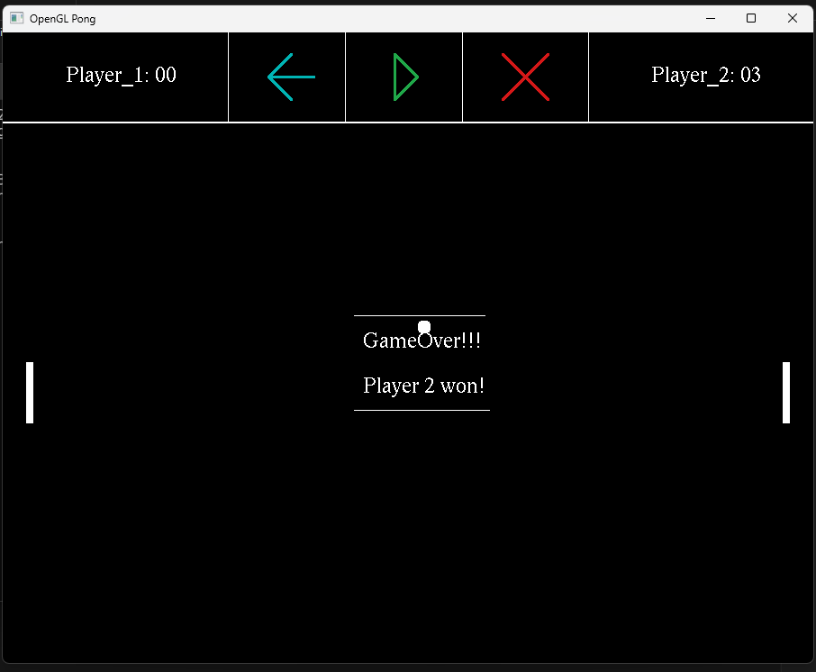

# OpenGL_Pong
Classical pong game implemented using OpenGL

## How to Run
First run the below command to clone the repo or download the zip of this repo
```
git clone https://github.com/eniac00/OpenGL_Pong.git
```
#### Folder Structure
```
.
├── Components.py
├── demo.gif
├── Game.py
├── main.py
├── Modules
│   ├── CircleModule.py
│   ├── ImportGL.py
│   ├── __init__.py
│   ├── LineModule.py
│   └── RectangleModule.py
├── README.md
├── Sound
│   ├── boink2.wav
│   ├── heehee.mp3
│   ├── hello.mp3
│   ├── paddleBreak.wav
│   └── twang.wav
├── TextUtils.py
└── Utils.py

3 directories, 17 files
```
#### Windows:
* Install the `pyopengl` and `pyopengl-accelerate` with OpenGL compatibality. You can use this website to download `pyopengl` and `pyopengl-accelerate` to download `*.whl` file with OpenGL bindings (make sure they match with your systems `python` version). link: [https://www.lfd.uci.edu/~gohlke/pythonlibs/](https://www.lfd.uci.edu/~gohlke/pythonlibs/)
* After downloading install the packages
```
pip install PyOpenGL‑3.1.6‑cp311‑cp311‑win_amd64.whl
pip install PyOpenGL_accelerate‑3.1.6‑cp311‑cp311‑win_amd64.whl 
pip install pygame

('cp311' -> since my python version is 3.11)
```

* Run the  game  with `main.py` and enjoy.
```
python main.py
```

#### GNU/Linux:
* Install python packages
```
pip install pygame pyopengl pyopengl-accelerate
```
* Install `freeglut3-dev` from your distributions package manager
* Run the game with `main.py` and enjoy
```
python main.py
```

## Demo


## ScreenShots





